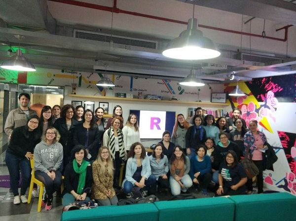

class:  split-30 with-border border-purple center middle

```{r setup, include=FALSE}
knitr::opts_chunk$set(echo = FALSE, fig.align = "center")
```

.column.bg-main3[.content.vmiddle.center[

## Beatriz Milz
```{r, out.width="90%", fig.align='center'}
knitr::include_graphics("img/beatriz.jpg")
```

<br><br><br>
]]

.column.bg-white[.content.vmiddle.center[
- R-Ladies São Paulo Co-organizer

  - Email: <a href="mailto:beatriz.milz@usp.br">beatriz.milz@usp.br</a>
  - Webpage: https://beatrizmilz.github.io/ 
  - Github: <a href="http://github.com/beatrizmilz">@beatrizmilz</a>
  - Twitter: <a href="http://twitter.com/beatrizmilz">@BeaMilz</a> 

- Doctorate Student - Environmental Sciences - University of São Paulo, Brazil
```{r, out.width="100%"}
knitr::include_graphics("img/logos_bia.png")
```

-  FAPESP postgraduate scholarship - Process nº 2018/23771-6 

- FAPESP Thematic Project - Process nº 2015/03804-9 

]]

---
class:  split-30 with-border border-purple center middle

.column.bg-main3[.content.vmiddle.center[


## Bruna Wundervald

```{r, out.width="90%", fig.align='center'}

```


<br><br><br>
]]

.column.bg-white[.content.vmiddle.center[
- R-Ladies São Paulo Co-organizer
  - Email: <a href="brunadaviesw@gmail.com">brunadaviesw@gmail.com</a>
  - Webpage: https://brunaw.com 
  - Github: <a href="http://github.com/brunaw">@brunaw</a>
  - Twitter: <a href="http://twitter.com/bwundervald">@bwundervald</a>

- Ph.D. Candidate in Statistics at Maynooth University, Ireland

- Science Foundation Ireland Career Development Award grant number
17/CDA/4695

```{r, out.width="40%"}
knitr::include_graphics("img/SFI.jpg")
```


]]


---
class:  center, middle

```{r, out.width="15%"}
knitr::include_graphics("img/hexlogorladies.jpeg")
```
## What is R-Ladies?

Worldwide organization that  promotes **gender diversity** in the `R` community. 

## How?

Meetups and mentorship in a friendly and safe environment. 


## For whom?
Underrepresented genders - including but not limited to:
  - cis/trans women, trans men, non-binary, genderqueer, agender


Learn more: [About us - R-Ladies](https://rladies.org/about-us/)


---
class:  center, middle
## R-Ladies in Brazil

- 12 R-Ladies Chapters:
Rio de Janeiro, Americana, Natal, Porto Alegre, **São Paulo**, Belo Horizonte, Curitiba, Niterói, Salvador, Florianópolis, Lavras, Goiânia.

- Brazil: 35% of R-Ladies chapters in Latin America.

```{r, out.width="38%", fig.cap="<center><b>R-Ladies in Latin America</center></b>"}

```

Reference: [R-Ladies Shiny App](https://gqueiroz.shinyapps.io/rshinylady/)  (June/2019)

---
class:  center, middle

## R-Ladies São Paulo

```{r }

```
- **First R-Ladies São Paulo Meetup** - August/2018

- **+430 members** - June/2019 

---
class: middle
## Activities

- Already held 10 events, including:
  - meetups, 
  - workshops, 
  - datathons.


```{r out.width="50%"}
knitr::include_graphics("img/foto_loggi.jpeg")
```

**+meetings are monthly being planned!**

---
class: middle

## Activities

###Content - Focused on some packages:
- Learning `dplyr`, `ggplot2`, `rmarkdown`
- Dealing with strings with `stringr`
- Presentations with `xaringan`
- Functional Programming with `purrr`

```{r out.width="22%", fig.align = "default"}
knitr::include_graphics(c("img/rlogos/hex-tidyverse.jpg","img/rlogos/hex-dplyr.png","img/rlogos/hex-stringr.png", "img/rlogos/hex-ggplot2.png", "img/rlogos/hex-purrr.jpg", "img/rlogos/hex-rmarkdown.png", "img/rlogos/hex-xaringan.png"))
```

---
class: middle

## Activities

###Content - Focused on case presentations:

- Exploring Open Data
- Google Analytics Data extraction
- News article with electoral data
- Economics and Transportation DataViz

```{r out.width="100%"}

```


---
class: middle
## Activities: partnership with other chapters

- Workshop with R-Ladies Niterói (May/2019).

```{r out.width="90%"}

```
---
class: middle

## Collaboration

- We also collaborate with other projects:
  - lectures, workshops,
  - always open to the community.  

- Sponsors: venues for the Meetups, coffe-break, and scholarships on courses and events.

```{r, out.width="60%", fig.cap="<center><b>Some organizations that collaborated with R-Ladies São Paulo</center></b>"}

```

---
class: middle

## Important points!

- The group provides a safe environment for people interested in `R`. 
   - Code of conduct: [https://github.com/rladies/starter-kit/wiki/Code-of-Conduct#portuguese](https://github.com/rladies/starter-kit/wiki/Code-of-Conduct#portuguese)

- All of the content presented is made available freely on github in portuguese:

   - [https://github.com/rladies/meetup-presentations_sao-paulo](https://github.com/rladies/meetup-presentations_sao-paulo)

- **All of the activities are free to attend**

  - The gratuity is very relevant in the Brazilian context:
  the few `R` courses available in Portuguese are often expensive, and there is no other active `R` group in São Paulo (the biggest city in Brazil!) that provides this type of content free of charge.

---
class: middle
## Conclusion

- The increasing popularity of the R-Ladies São Paulo shows us how important it is to support it, 

- It can be the key to motivate the creation of other chapters in Brazil, 

- It helps to increase the strength of the Brazilian R community and the inclusion of underrepresented groups. 

```{r, out.width="40%", fig.cap="<center><b>Illustration by Allison Horst - Twitter: <a href='https://twitter.com/allison_horst/status/1066382489080389633'> @allison_horst</a> </center></b>"}
knitr::include_graphics("img/alissonhorst.jpg")
```

---
class:  center, middle

### To find out  more, visit [R-Ladies Global](https://rladies.org/) & [R-Ladies Shiny App](https://gqueiroz.shinyapps.io/rshinylady/).

```{r, out.width="100%", fig.cap="<center><b>R-Ladies Shiny App - 17/06/2019</center></b>"}

```

---
class:  center, middle

## Thanks!

- **[useR! 2019](https://user2019.r-project.org/)** - Diversity Scholarship

- **[R-Ladies Global](https://rladies.org/)**

- **R-Ladies São Paulo Co-Organizers**: 
  - [Haydée Svab](https://www.linkedin.com/in/hsvab/)
  - [Alissa Munerato](https://br.linkedin.com/in/alissa-munerato-1b0501103)
  - [Bruna Wundervald](http://brunaw.com/)
  - [Beatriz Milz](https://beatrizmilz.github.io/)
  - [Bruna Garbes](https://github.com/brunagarbes)
  - [Nathália Demetrio](https://github.com/natydemi)


- Presentation made with [Xaringan](https://github.com/yihui/xaringan) and [Kunoichi](https://github.com/emitanaka/ninja-theme).
